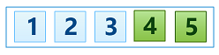

## Bubble Sort
Today we are going to look at one of the elementary sorting algorithm - [Bubble Sort][]. This is usually the first sorting algorithm taught because it is the easiest one to conceptually understand and implement. But keep in mind that it's also one of the least efficient in practice.

So let's get started!

### Rules of the Game
The basic idea is to compare each pair of adjacent elements and swap them if the element on left goes after the element on the right. At the end of each pass through all elements the *largest* element **bubbles** to the end of the array. Hence, the name of the algorithm - [Bubble Sort][]. We continue passing through elements from the first till the last until the moment when there is no swaps during the pass. It is a sign for us that all elements are completely sorted.

To better understand the algorithm, let's look at simple example.

### Example
Consider we have the following array:  

####Iteration #1  
At the beginning of the pass we compare first pair of adjacent elements - `5` and `2`:  

`5` goes after `2`, so we swap them:  

Then we compare next pair of adjacent elements - `5` and `1`:  

`5` goes after `1`, so we swap again:  

Then it comes the third pair of adjacent elements - `5` and `3`:  

And again `5` goes after `3`, so we swap them too:  

And the last pair of adjacent elements - `5` and `4`:   

Once again `5` goes after `4`, so we swap them:  

At the end of the first pass we have our largest element `5` bubbled to the end of the array:  

####Iteration #2 
Let's start second pass, once again comparing and swapping adjacent elements in the array. 

The first pair of adjacent elements that we have - `2` and `1`:  

`2` goes after `1`, so we swap them:  

Then we compare next pair - `2` and `3`:  

`2` goes before `3`, so no swaps here.

The last pair of adjacent elements in thi pass - `3` and `4`:  

`3` goes before `4`, everything is good, no swaps here too. Thus we have **two** largest elements **bubbled** to the end of the array:  

####Iteration #3 
As usual we start with the first pair of the adjacent elements - `1` and `2`:  

As we know `1` goes before `2`, no swaps are needed here.

Then move to the next pair of the elements - `2` and `3`:  

Once again everything is good, no swaps here. AS it is the last pair, the iteration is completed. Thus, we have **three** elements bubbled to the end of the array:  

During the last pass as you see we have know swaps, it means that we can stop our iterations as our array is completely sorted:  

### Algorithm Invariants
Based on our simple example let's try to define invariants that we need to check during the algorithm implementation for its correct behaviour. As you can see for each pass the following should be true:

* at the end of each pass the next largest element is bubbled to the end of the array;
* as soon element is bubbled, it becomes frozen.

### Implementation

### Improvements

### Analysis

### Summary 
That is it for the [Bubble Sort][]. As you can see it's not much efficient. Next time we will look at [Selection Sort Algorithm][next].

[Bubble Sort]: https://en.wikipedia.org/wiki/Bubble_sort "Bubble Sort - Wikipedia"
[sorting-algorithm]: ../../README.md
[in-place]: ../../README.md#in-place-and-not-in-place
[comparison sort]: ../README.md
[next]: ../selection-sort/README.md "Insertion Sort Algorithm"
