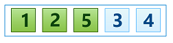
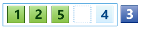

## Insertion Sort
Today we are going to look at yet another elementary sorting algorithm - [Insertion Sort][]. This is typically the third [sorting algorithm][overview] to study in computer science, after [Bubble Sort][bubble-sort] and [Selection Sort][selection-sort]. Everyone who likes play bridge is familiar with it. This algorithm is again an [in-place][] [comparison sort][] algorithm that is not actually efficient for large data sets but at some circumstances can perform better than previously discussed two algorithms.

So let's get started!

### Rules of the Game
The main idea is again to divide array into two parts:

* sorted part at left end; 
* unsorted part at right end.

Initially the sorted part is empty and the unsorted part is the entire list. Then we add the first leftmost element (that is the first entry of the array) of the unsorted part to the sorted section. As an array of one item is always sorted, we just move by one element the boundary of the unsorted part and complete the first iteration.

Then on the second iteration we again add the next leftmost element (that is the second entry of the array) of the unsorted part to the sorted part. Now as an array of two elements is not always sorted, we need to put this newly added element at the correct position in the sorted part to keep it sorted: 

* if the new element goes after or equal the last element in the sorted part, then we do nothing and move to the next iteration;  
* if it goes before the last element in the sorted part, then we delete its values (copy it to a temporal variable) and shift the last sorted element into the new vacant spot. We repeat the shift for all elements from the sorted part until reach the one that is less than or equal our memorized value;
* if we reach element in the sorted part that less than or equal memorized value, we push our memorized value on the spot before such element;
* if we reach the start of the array (so we have shifted all sorted elements to the right), we push our memorized value as new first entry in the sorted part of the array. 

This process is repeated until the unsorted part becomes empty and the sorted part contains all elements of the array correctly sorted.

So on each iteration we **insert** next leftmost element from the unsorted part to the sorted part, hence the name of the algorithm - [Insertion Sort][].

### Example
Let's look at simple example. Consider we have the following array:  


####Iteration #1  
We just insert the leftmost element  of the unsorted part to the sorted part and move to the next iteration:  


####Iteration #2 
Next we add next leftmost element  of the unsorted path to the sorted part:  


Then we check whether the previous leftmost element from the sorted part goes before this new added element or after. As we know  goes after , so we remove  from the array and store it in a temporary variable:  


Then we shift  by one position to the right into the new vacant spot:    


As we reach the start of the array, there is no more elements to compare and shift, we push  back to the array:  


Now we have array of two elements sorted.

####Iteration #3 
Then we add next leftmost element  of the unsorted part to the sorted part:  


As we see the previous leftmost element in the sorted part  goes after , so we need to shift elements. First of all we remove  from the array and copy it to a temporal variable:  


Then we shift  to the new vacant spot:  


Then we compare next element from the sorted part with our temporal variable. As we see  goes after , so we need one more shift:  


As we reach the start of the array, no elements to shift, so we push  back to the array:  


Now we have array of three elements sorted.

####Iteration #4
The next leftmost element of the unsorted part is :  


And again we need to shift. As you see the leftmost element of the sorted part  goes after our current element. So once again we remove element from the array and store it in a temporal variable:  


Then shift the previous leftmost element of the sorted part to the new vacant spot:  


But here we need only one shift, the next element in the sorted part  goes before our current element. So here we stop and push  back to the array.
 
####Iteration #5
And the last element of the unsorted part comes:  


We add it to the sorted part but unfortunately cannot leave there as is. The previous leftmost element of the sorted part  goes after our current element, so we once again need shifts.

We remove our current element from the array and store it in a temporal variable:  


Then we shift  to the new vacant spot:  


As you see only one shift is needed as the next element if the sorted part  goes before our current element. So we stop here and push  from the temporal variable back to the array:  
 

And now our array is completely sorted. Let's move to the algorithm implementation.

### Algorithm Invariants
Based on the discussed example let's define invariants that we need to check during the algorithm implementation for its correct behaviour. As you can see for any position `i` in the array the following should be true:

* all elements to the left of the position `i` are already sorted but not yet fixed, it means that they can be shifted to the right during next iterations; 
* elements to the right of the position `i` (including element at position `i`) are not yet seen, and so are not yet sorted;

### Implementation
As you remember we have already defined two auxiliary routines for elements comparison and swapping. But here we don't really need swaps that move elements around. Each iteration we possibly will need to shift some elements to the right by some number of positions. For simplification let's define a new routine `shiftRight` for this operation:
```javascript
function shiftRight(array, i) {
    array[i + 1] = array[i];
}
```

Now we are ready to complete the algorithm implementation:
```javascript
function sort(array) {
    var n = array.length,
        i, j, temp;

    for (i = 0; i < n; i++) {
        temp = array[i];
        
        for(j = i - 1; j >= 0 && less(temp, array[j]); j--) {
            shiftRight(array, j);
        }
        
        array[j + 1] = temp;
    }

    return array;
}
```

As you can see we start from the first element and go till the last element of the array. Each element is temporary saved to a variable to find the correct spot for it among already sorted elements. During shifts we do not observe elements to the right of the current position, we only shift elements from the left. Thus, we have all our invariants to be true. 

### Improvements
Even it's again a very simple algorithm we can add some improvements to make it even better.

As we mentioned previously, array of one element is always sorted. This means that we actually can skip first iteration at all as we won't shift elements here. So we can start out outer loop from the `1` position. 

Here is our final implementation:
```javascript
function sort(array) {
    var n = array.length,
        i, j, temp;

    for (i = 1; i < n; i++) {
        temp = array[i];
        
        for(j = i - 1; j >= 0 && less(temp, array[j]); j--) {
            shiftRight(array, j);
        }
        
        array[j + 1] = temp;
    }

    return array;
}
```

### Analysis
Let's think what we can learn from this algorithm.

* **It's in-place algorithm**  
As you can see we don't use any additional memory except one variable to store the current processed element.

* **It's stable**  
All elements of the array are only shifted to the right if they go before current processed element, so we don't break elements relative order. It's the first *stable* algorithm in our toolbox.

* **Sensitive to the input array state**  
This is example of **adaptive** algorithm. As you can see on each iteration we compare our current element with elements on the left starting from the leftmost. And we start shifting if only the leftmost element goes after our current element. This means that if our array is already sorted we will never need shift elements and will complete execution much faster. 

* **Has O(n^2) complexity**  
In average case this algorithm have **O(n^2)** complexity. For randomly ordered array we can expect that for each element we would need to shift the half of elements on the left of the current position. But it's very easy to prove that for already sorted array we will have `0` swaps and `n-1` compares at most. It means that in the best case we will have **O(n)** complexity.

You will see later that other [sorting algorithms][overview] have more efficient times than this one.

### Summary 
That is it for the [Insertion Sort][]. As you can see it's not much efficient. Next time we will look at [Merge Sort Algorithm][next].

[Insertion Sort]: https://en.wikipedia.org/wiki/Insertion_sort "Insertion Sort - Wikipedia"
[overview]: ../../README.md
[in-place]: ../../README.md#in-place-and-not-in-place
[comparison sort]: ../README.md
[next]: ../merge-sort/README.md "Merge Sort Algorithm"
[bubble-sort]: ../bubble-sort/README.md "Bubble Sort Algorithm"
[selection-sort]: ../selection-sort/README.md "Selection Sort Algorithm"
