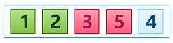
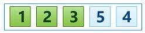
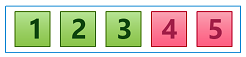

## Selection Sort
Today we are going to look at another elementary sorting algorithm - [Selection Sort][]. This is an [in-place][] [comparison sort][] algorithm that is not actually efficient for large data sets but is also a good example to be known for educationl purpose. 

So let's get started!

### Rules of the Game
The main idea is to divide array into two parts:

* sorted part at left end; 
* unsorted part at right end.

Initially the sorted part is empty and the unsorted part is the entire list. Then we find the *smallest element* in the unsorted part and swap it with the *leftmost element* of that part. As the unsorted part is the entire list at the moment, we actually swap with the *first entry* of the array. 

Thus, we have:

* found smallest element becomes new first entry of the array and the first element in the sorted part;
* all other elements are still in the unsorted part.

Next we find the *next smallest element*, looking only through items in the unsorted part, and swap it again with the *leftmost element* of that part (that is the *second entry* of the array at the moment). That next smallest element becomes the second element in the sorted part, the boundary of the unsorted part moves by one element to the right again.

This process is repeated until the moment when the unsorted part becomes empty and the sorted part contains all elements of the array correctly sorted.

Sounds pretty simple, does not it? As on each iteration we are **selecting** next smallest item, algorithm is called [Selection Sort][].

### Example
Let's look at simple example. Consider we have the following array:  


####Iteration #1  
To get the first *smallest element* we scan the entire list sequentially and find that it is :  


So we swap it with the *first* entry of the array   


Thus, we have that our sorted part starts containg one element and the boundary of the unsorted part moves by one element to the right.  

####Iteration #2 
The next *smallest element* that we find in the unsorted part is :  


And as it stays at the correct position, we actually do nothing, only moves by one element the boundary of the unsorted part:  


####Iteration #3 
The next *smallest element* that we find in the unsorted part is :  


And we swap it with the leftmost element (that is the *third* entry of the array) :  


After moving by one element the boundary of the unsorted part, we have **three** elements sorted:  


####Iteration #4
The next *smallest* element that we find is :  


And we swap it with the leftmost element (that is the *fourth* entry of the array) :  


And once again moves by one element the boundary of the unsorted part. Now we have **four** elements sorted.:  

 
####Iteration #5
The last smallest element is  and it already stays at the correct position, as it's the last element in the unsorted part of the array. So we just moves by one element the boundary of the unsroted part and complete sorting:  


### Algorithm Invariants
Based on the discussed example let's define invariants that we need to check during the algorithm implementation for its correct behaviour. As you can see for any position `i` in the array the following should be true:

* all elements to the left of the position `i` are already sorted and fixed, it means that they won't be touched starting from this moment; 
* no elements to the right of the position `i` (including element at position `i`) are less than any elements to the left;
* among elements to the right of the position `i` (including element at position `i`) might be some elements that are equals the element at position `i-1`;
* except element at position `i-1` there is no other elements to the left of the position `i` that can be equals any elements to the right of the position `i` (including element at position `i`).

### Implementation
AS you remember we have already defined two auxiliary routines for elements comparison and swaping. To complete implementation of the entire algorithm, we need to have the following:

* inner loop to find next smallest item in the array;
* outer loop to swap found smallest item with the current entry.

That's it, it's really simple as it sounds. Here is the implementation:
```javascript
function sort(array) {
    var n = array.length, 
		i, j, min;

    for (i = 0; i < n; i++) {
        min = i;
        for (j = i + 1; j < n; j++) {
            if (less(array, j, min)) {
                min = j;
            }
        }

        swap(array, i, min);
    }

    return array;
}
```

As you can see we start at position `0` and go till the last position of the array. For each position we are looking for the next smallest element, observing only elements to the right of the current position. That is done to guard our invariant:
> all elements to the left of the position `i` are already sorted and fixed, it means that they won't be touched starting from this moment

As all elements to the left of the current position are *frozen*, we cannot observe them for the smallest one. So we temporary assume that next smallest element is at position `i` (current *cursor* position) and start our inner loop from `i+1` position till the end of the array. Each element on the right of the position `i` we compare with current found smallest element at position `min`. If current observing item is less than we found before, we save its position to the variable `min`. It becomes our new smallest item.  

### Improvements
Even it's a very simple algorithm we can add some improvements to make it evene better.

First of all it may happen that next smallest element that we are looking for is already in place, at current position `i`. In this case we are swapping it with itself that sounds silly. Let's add a guard to avoid such redundant exchange:
```javascript
if (i != min) {
    swap(array, i, min);
}
 ```
 
Next, we can even reduce our outer loop by one iteration. As you can see outer loop iterates array till its last element, including this *last element*. But for the last element we don't have any elements to swap with. As it's the last element, there is no element to the right of it to observe, and all elements to the left are already sorted and fixed. So we really have nothing to do there. That is why we can change exit condition for the outer loop by skipping last iteration at all.

Here is our final implementation:
```javascript
function sort(array) {
    var n = array.length,
		i, j, min;

    for (i = 0; i < n - 1; i++) {
        min = i;
        for (j = i + 1; j < n; j++) {
            if (less(array, j, min)) {
                min = j;
            }
        }

        if (i != min) {
            swap(array, i, min);
        }
    }

    return array;
}
```

### Analysis
Let's think what we can learn from this algorithm.

* **It's in-place algorthm**  
As you can see we don't use any additional memory except one variable to store the position of the smallest element.

* **It's not stable**  
As we swap elements by random indeces on each iteration, we break elements relative order and cannot restore it back at the end. So if array contains some equal values, there is a big chance that their relative order will be broken at the end.

* **Insensitive to the input array state**  
As you can see we iterate through the items of the array looking for the smallest item independently of the initial array state. Even if array is already sorted, we will still look through all elements to the right starting from the first position. It sounds a litle bit odd, apparently, we will waste our time. But it's how this algorithm is designed. So this algorithm is **non-adaptive**.
 
* **Minimal number of swaps**  
As you can see we swap array items only in the outer array. So there can be not more than `n-1` exchanges for the array of `n` elements. That means that we have **linear number of swaps**. It's really a good value. No other sorting algorithms can boast of such good performance. In situations in which moving elements is nore expensive than comparing then, this algorithm performs beter than others.

* **Has O(n^2) complexity**  
As you can see the first swap requires `n-1` comparisons, the second - `n-2`, the third - `n-3`, and so on. This is the series `(n-1) + (n-2) + (n-3) + ... + 1`, which simplifies to `n*(n-1)/2`. This means that this algorithm is `O(n^2)`. This is true for the best, average and worst case because the lagorithm is non-adaptive to the initila state of the array. AS we already learned even if array is already sroted, the algorithm will still performs the sam number of comparisons.

You will see later that other [sorting algorithms][sorting-algorithm] have more efficient times than this one.

### Summary 
That is it for the [Selection Sort][]. As you can see it's not much efficient. Next time we will look at [Insertion Sort Algorithm][next].

[Selection Sort]: https://en.wikipedia.org/wiki/Selection_sort "Selection Sort - Wikipedia"
[sorting-algorithm]: ../../README.md
[in-place]: ../../README.md#in-place-and-not-in-place
[comparison sort]: ../README.md
[next]: ../insertion-sort/Insertion-Sort.md "Insertion Sort Algorithm"
